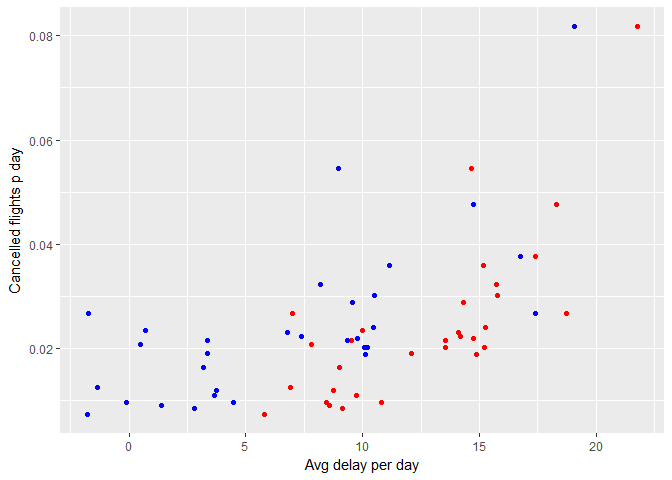
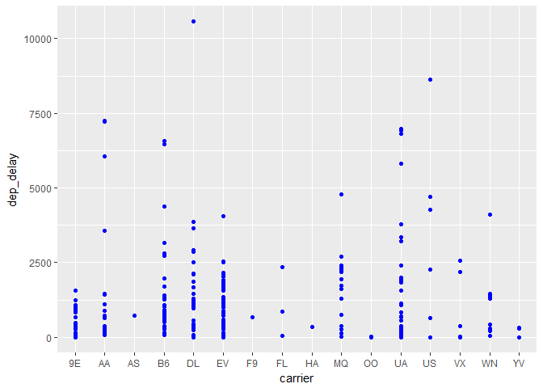

# R-Club-homework_17May


## Homework 17 May 2017

### Exercises 5.6.7
1.brainstorm different ways to assess the typical delay charactaristics of a group of flights:

```r
library(tidyverse)
```

```
## Loading tidyverse: ggplot2
## Loading tidyverse: tibble
## Loading tidyverse: tidyr
## Loading tidyverse: readr
## Loading tidyverse: purrr
## Loading tidyverse: dplyr
```

```
## Conflicts with tidy packages ----------------------------------------------
```

```
## filter(): dplyr, stats
## lag():    dplyr, stats
```

```r
library(nycflights13)
delay_char <- flights %>% group_by(flight, tailnum) %>% summarise(n = n(), fifteen_early = mean(arr_delay == -15, na.rm = TRUE), fifteen_late = mean(arr_delay == 15, na.rm = TRUE), ten_always = mean(arr_delay == 10, na.rm = TRUE), thirty_early = mean(arr_delay == -30, na.rm = TRUE), thirty_late = mean(arr_delay == 30, na.rm = TRUE), percentage_on_time = mean(arr_delay == 0, na.rm = TRUE), twohours = mean(arr_delay > 120, na.rm = TRUE)) %>% map_if(is_double, round, 2) %>% as_tibble()
```


1.1 A flight is 15 minutes early 50% of the time, and 15 minutes late 50% of the time  


```r
delay_char %>% filter(fifteen_early == 0.5, fifteen_late == 0.5)
```

```
## # A tibble: 8 × 10
##   flight tailnum     n fifteen_early fifteen_late ten_always thirty_early
##    <int>   <chr> <int>         <dbl>        <dbl>      <dbl>        <dbl>
## 1    623  N972AT     2           0.5          0.5          0            0
## 2    983  N715JB     2           0.5          0.5          0            0
## 3   1131  N3FKAA     2           0.5          0.5          0            0
## 4   1203  N665JB     2           0.5          0.5          0            0
## 5   1593  N75425     2           0.5          0.5          0            0
## 6   3622  N524MQ     3           0.5          0.5          0            0
## 7   4425  N854MQ     2           0.5          0.5          0            0
## 8   4461  N604SW     2           0.5          0.5          0            0
## # ... with 3 more variables: thirty_late <dbl>, percentage_on_time <dbl>,
## #   twohours <dbl>
```

1.2. A flight is always 10 minutes late.


```r
delay_char %>% filter(ten_always == 1)
```

```
## # A tibble: 1,088 × 10
##    flight tailnum     n fifteen_early fifteen_late ten_always thirty_early
##     <int>   <chr> <int>         <dbl>        <dbl>      <dbl>        <dbl>
## 1       1  N524JB     1             0            0          1            0
## 2       1  N712JB     1             0            0          1            0
## 3       3  N260WN     1             0            0          1            0
## 4       3  N262WN     1             0            0          1            0
## 5       3  N265WN     1             0            0          1            0
## 6       3  N38454     1             0            0          1            0
## 7       3  N521JB     1             0            0          1            0
## 8       4  N646JB     1             0            0          1            0
## 9       8  N599JB     1             0            0          1            0
## 10     10  N37293     1             0            0          1            0
## # ... with 1,078 more rows, and 3 more variables: thirty_late <dbl>,
## #   percentage_on_time <dbl>, twohours <dbl>
```

1.3. A flight is 30 minutes early 50% of the time, and 30 minutes late 50% of the time

```r
delay_char %>% filter(thirty_early == 0.5, thirty_late == 0.5)
```

```
## # A tibble: 0 × 10
## # ... with 10 variables: flight <int>, tailnum <chr>, n <int>,
## #   fifteen_early <dbl>, fifteen_late <dbl>, ten_always <dbl>,
## #   thirty_early <dbl>, thirty_late <dbl>, percentage_on_time <dbl>,
## #   twohours <dbl>
```

1.4. 99% of the time a flight is on time. 1% of the time it’s 2 hours late.

```r
delay_char %>% filter(percentage_on_time == 0.99 & twohours == 0.01)
```

```
## # A tibble: 0 × 10
## # ... with 10 variables: flight <int>, tailnum <chr>, n <int>,
## #   fifteen_early <dbl>, fifteen_late <dbl>, ten_always <dbl>,
## #   thirty_early <dbl>, thirty_late <dbl>, percentage_on_time <dbl>,
## #   twohours <dbl>
```

Which is more important: arrival delay or departure delay?
_I think arrival dely because they are asking about the timing of the flights arriving_

2. Come up with another approach that will give you the same output as **not_cancelled %>% count(dest)** and **not_cancelled %>% count(tailnum, wt = distance)** (without using count()).

```r
not_cancelled <-  flights %>% filter(!is.na(dep_delay), !is.na(arr_delay))
not_cancelled %>%  group_by(dest) %>%  summarise(n = n())
```

```
## # A tibble: 104 × 2
##     dest     n
##    <chr> <int>
## 1    ABQ   254
## 2    ACK   264
## 3    ALB   418
## 4    ANC     8
## 5    ATL 16837
## 6    AUS  2411
## 7    AVL   261
## 8    BDL   412
## 9    BGR   358
## 10   BHM   269
## # ... with 94 more rows
```

3.Our definition of cancelled flights **(is.na(dep_delay) | is.na(arr_delay) )** is slightly suboptimal. Why? Which is the most important column?
_This is suboptimal because it searches both columns but if the flight did not depart then it was probably canceled so we probably only need (is.na(dep_delay))._

```r
flights %>% filter(is.na(dep_delay)|is.na(arr_delay))
```

```
## # A tibble: 9,430 × 19
##     year month   day dep_time sched_dep_time dep_delay arr_time
##    <int> <int> <int>    <int>          <int>     <dbl>    <int>
## 1   2013     1     1     1525           1530        -5     1934
## 2   2013     1     1     1528           1459        29     2002
## 3   2013     1     1     1740           1745        -5     2158
## 4   2013     1     1     1807           1738        29     2251
## 5   2013     1     1     1939           1840        59       29
## 6   2013     1     1     1952           1930        22     2358
## 7   2013     1     1     2016           1930        46       NA
## 8   2013     1     1       NA           1630        NA       NA
## 9   2013     1     1       NA           1935        NA       NA
## 10  2013     1     1       NA           1500        NA       NA
## # ... with 9,420 more rows, and 12 more variables: sched_arr_time <int>,
## #   arr_delay <dbl>, carrier <chr>, flight <int>, tailnum <chr>,
## #   origin <chr>, dest <chr>, air_time <dbl>, distance <dbl>, hour <dbl>,
## #   minute <dbl>, time_hour <dttm>
```


```r
flights %>% filter(is.na(dep_delay))
```

```
## # A tibble: 8,255 × 19
##     year month   day dep_time sched_dep_time dep_delay arr_time
##    <int> <int> <int>    <int>          <int>     <dbl>    <int>
## 1   2013     1     1       NA           1630        NA       NA
## 2   2013     1     1       NA           1935        NA       NA
## 3   2013     1     1       NA           1500        NA       NA
## 4   2013     1     1       NA            600        NA       NA
## 5   2013     1     2       NA           1540        NA       NA
## 6   2013     1     2       NA           1620        NA       NA
## 7   2013     1     2       NA           1355        NA       NA
## 8   2013     1     2       NA           1420        NA       NA
## 9   2013     1     2       NA           1321        NA       NA
## 10  2013     1     2       NA           1545        NA       NA
## # ... with 8,245 more rows, and 12 more variables: sched_arr_time <int>,
## #   arr_delay <dbl>, carrier <chr>, flight <int>, tailnum <chr>,
## #   origin <chr>, dest <chr>, air_time <dbl>, distance <dbl>, hour <dbl>,
## #   minute <dbl>, time_hour <dttm>
```

4. Look at the number of cancelled flights per day. Is there a pattern? Is the proportion of cancelled flights related to the average delay?

```r
 flights %>% group_by(day) %>% summarise(cancelled = mean(is.na(dep_delay)), mean_dep = mean(dep_delay, na.rm = T), mean_arr = mean(arr_delay, na.rm = T)) %>% ggplot(aes(y = cancelled)) + geom_point(aes(x = mean_dep), colour = "red") + geom_point(aes(x = mean_arr), colour = "blue") + labs(x = "Avg delay per day", y = "Cancelled flights p day")
```

<!-- -->
_The number of cancelled flights increases and the ave delay per day increases._

5. Which carrier has the worst delays? Challenge: can you disentangle the effects of bad airports vs. bad carriers? Why/why not? (Hint: think about flights %>% group_by(carrier, dest) %>% summarise(n())).


```r
flights %>% group_by(carrier, dest) %>% summarise(dep_delay = n()) %>% ggplot(aes(y = dep_delay)) + geom_point(aes(x = carrier), color = "blue")
```

<!-- -->

_Looks like EV has more late flights but it looks like UA has the more longer delays overall._

6. What does the **sort** argument to **count()** do. When might you use it?
_ you can use this to sort a set of data based on the counts_
